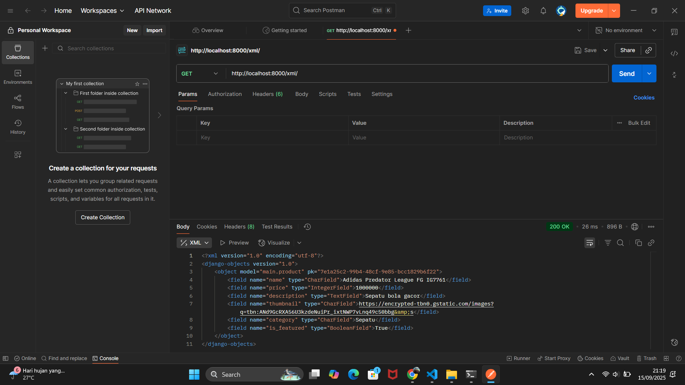
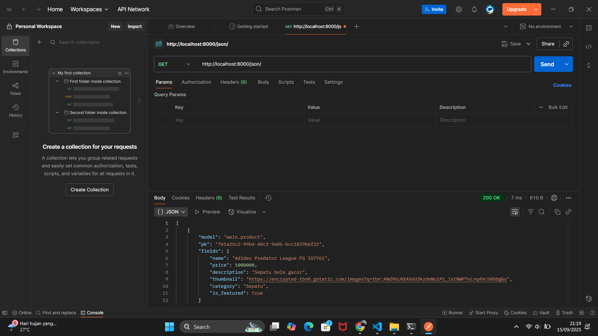
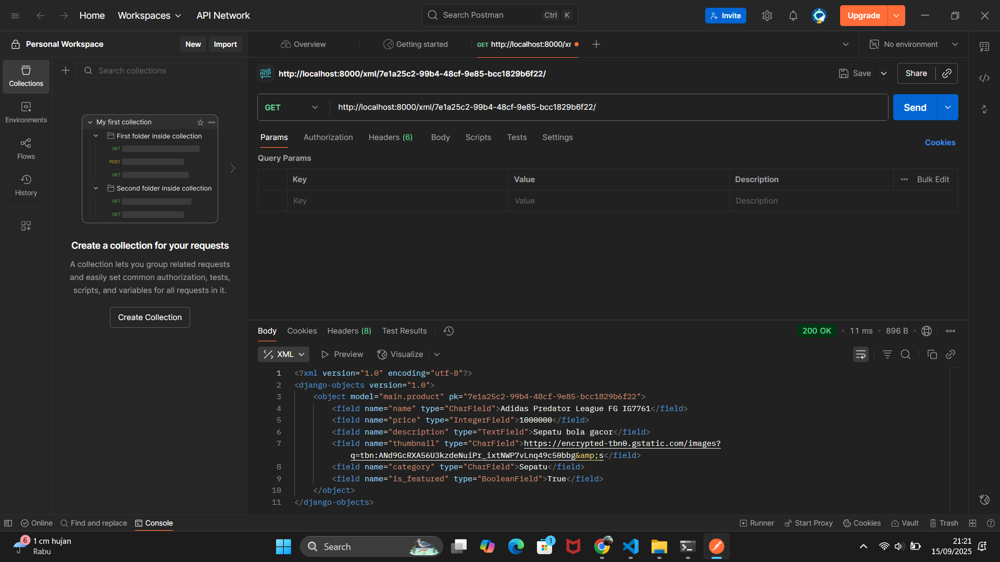
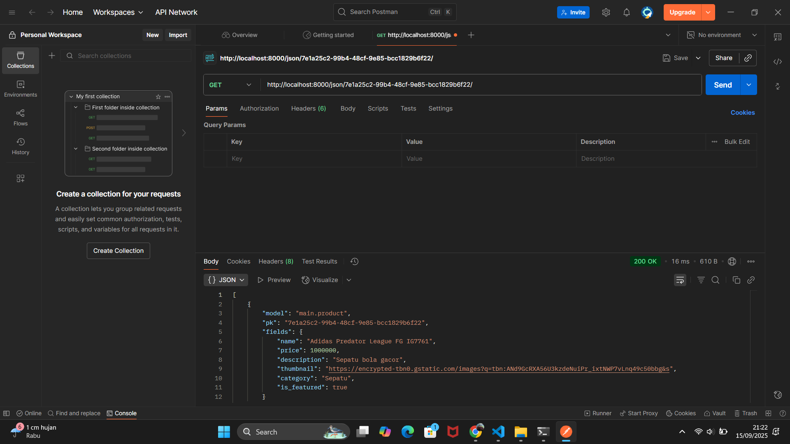

Nama : Aaron Nathanael Suhaendi

NPM : 2406437073

Kelas : PBP B

Tautan PWS: https://aaron-nathanael-aaronkickstore.pbp.cs.ui.ac.id/

Tugas 3

Nomor 1

Kita butuh data delivery dalam sebuah platform agar data bisa dikirim dari satu tempat ke tempat lain dengan benar, cepat, dan aman. Kalau tidak ada data delivery, platform tidak akan bisa jalan karena tidak ada cara untuk mengirim atau menerima data antara pengguna, server, atau sistem. Dengan adanya data delivery, informasi bisa sampe ke pengguna dengan tepat, aksesnya cepat, dan data juga tetap aman. Selain itu, data delivery juga penting kalau platform harus terhubung dengan layanan lain, misalnya payment gateway atau API. Misalnya user minta data produk, server harus bisa mengirim datanya dengan format tertentu(misal XML/JSON/HTML). Tanpa adanya mekanisme ini, user tidak akan bisa melihat data yang mereka butuhkan di platform.

Nomor 2

Menurut saya sendiri, JSON lebih baik dibandingkan XML. Alasannya adalah karena JSON punya ukuran file yang lebih kecil sehingga proses transfer data bisa lebih cepat daripada XML. Selain itu, JSON juga lebih ringkas dan gampang dibaca karena strukturnya sederhana dan tidak dipenuhi tag-tag kosong seperti XML. File JSON juga terlihat lebih bersih dan terorganisir, sedangkan XML cenderung lebih rumit dan terkesan ketinggalan zaman karena struktur tag-nya bikin file jadi lebih besar dan susah dibaca. Jadi, menurut saya hal-hal tersebutlah yang membuat JSON lebih populer dan banyak dipake dibandingkan XML.

Nomor 3

is_valid() dipakai untuk ngecek apakah data yang diinput user sesuai aturan form (misalnya field wajib diisi, format email benar, dll). Kita butuh method ini supaya data yang masuk ke database tetep bersih dan valid, jadi tidak ada data aneh-aneh atau error saat diproses.

Nomor 4

csrf_token berfungsi untuk melindungi form dari serangan CSRF(Cross Site Request Forgery). Kalau kita gak pake token ini, penyerang bisa bikin form palsu di website lain yang diem-diem mengirim request ke server kita atas nama user yang sedang login. Akibatnya, data user bisa dimanipulasi tanpa sepengetahuan mereka.

Nomor 5

Checklist 1: Saya menambahkan empat fungsi baru di views.py, yaitu show_xml, show_json, show_xml_by_id, dan show_json_by_id. Keempat fungsi ini menggunakan HttpResponse dan serializers untuk menampilkan data dalam format XML atau JSON.

Checklist 2: Setelah itu, saya mengedit urls.py dengan mengimport fungsi tadi dan menambahkan path baru, supaya masing-masing fungsi bisa diakses lewat URL tadi.

Checklist 3: Saya membuat fungsi create_product dan show_product di views.py, lalu menambahkan route nya di urls.py. Lalu di main.html, saya menambahkan button “Add” dan juga looping supaya semua produk bisa ditampilkan. Saya juga membuat file create_product.html untuk menampilkan form tambah produk.

Checklist 4: Saya membuat forms.py yang berisi class ProductForm untuk menerima input data produk dari user. Lalu saya import ProductForm ke dalam views.py. Setelah itu, saya menambahkan product_list = Product.objects.all() ke dalam function show_main dan memasukkannya ke context supaya semua produk dari database bisa otomatis ditampilkan di halaman main.html.

Checklist 5: Saya membuat file product_detail.html yang terhubung dengan show_product di views.py untuk menampilkan detail setiap produk, lalu menambahkan routing nya di urls.py.

Nomor 6

Sudah mantap kak, semuanya sudah jelas. Thank you so much!!!

Nomor 7

Tugas 2

Nomor 1

Checklist 1: Pertama saya membuat direktori bernama "Aaron Kickstore" yang saya gunakan untuk menyimpan proyek Git-nya. Kemudian saya menginisiasi repositori baru dengan perintah git init. Selanjutnya, saya juga membuat repository baru di Github bernama "Aaron-Kickstore". Setelah melakukan inisiasi repositori lokal, langkah selanjutnya adalah menghubungkannya dengan repositori di GitHub. Setelah menghubungkan antara repositori lokal dengan repositori github, saya melakukan clone repositori ke komputer lokal. Selanjutnya, saya mengaktifkan Virtual Environment dengan melakukan "python -m venv env" kemudian mengaktifkannya. Setelah itu, saya membuat berkas requirements.txt dan tambahkan beberapa dependencies. Langkah terakhir, saya membuat dan memodifikasi file ".env", ".env.prod", dan "settings.py", kemudian menjalankan migrasi database dengan cara "python manage.py migrate" dan menjalankan server Django dengan perintah "python manage.py runserver". Proyek Django baru berhasil dibuat.

Checklist 2: Masuk ke direktori utama, kemudian aktifkan virtual environment yang telah dibuat sebelumnya dengan menjalankan perintah "env\Scripts\activate". Kemudian jalankan perintah "python manage.py startapp main" untuk membuat aplikasi baru dengan nama main. Kemudian saya menambahkan "main" dalam list bernama INSTALLED_APPS yang ada di settings.py dari direktori proyek.

Checklist 3: Saya buka berkas urls.py yang ada di dalam direktori proyek dan saya tambahkan rute URL "path('', include('main.urls'))," di list urlpatterns sehingga aplikasi main dapat diakses.

Checklist 4: Saya membuat model pada aplikasi main dengan cara membuat class Product di models.py. Di dalam Class tersebut berisi atribut seperti id, name, price, description, thumbnail, category, dan is_featured.

Checklist 5: Saya memodifikasi views.py dengan menambahkan sebuah function bernama show_main. Function ini akan menyiapkan sebuah dictionary yang berisi data dengan key npm, nama, app_name, dan class. Selanjutnya, saya juga mengubah main.html agar dapat menampilkan data tersebut menggunakan template variables. Terakhir, di bagian akhir function pada views.py, saya return render untuk menangani request HTTP dan menampilkan halaman HTML sesuai data yang telah dikirim dari dictionary tadi.

Checklist 6: Pertama, saya mengonfigurasi routing URL aplikasi main dengan cara membuat berkas urls.py di dalam direktori main, jangan lupa import path dan fungsi show_main dari views.py pada direktori main, kemudian saya mendefinisikan app_name untuk penamaan routing dan urlpatterns yang berisi "path('', show_main, name='show_main')".

Checklist 7: Saya melakukan migration dan commit semua perubahan yang telah dilakukan. Di terminal ketik "git remote add pws https://pbp.cs.ui.ac.id/aaron.nathanael/aaronkickstore", kemudian git branch -M master dan kemudian "git push pws master". Terakhir tinggal buka "https://aaron-nathanael-aaronkickstore.pbp.cs.ui.ac.id/".

Nomor 2

Bagan yang berisi request client ke web aplikasi berbasis Django beserta responnya:
https://share.google/images/ki38szasSv8O51SYQ

Penjelasan bagan:

Client

Pengguna mengirim request lewat browser, misalnya membuka URL tertentu di aplikasi Django.

URLconf

Django akan mencocokkan URL yang diminta dengan daftar pola URL yang ada di urls.py. Jika cocok, maka Django akan meneruskan permintaan tersebut ke fungsi View yang sesuai.

Views

View adalah tempat logika utama aplikasi. Dari sini, Django bisa mengambil data dari model dan memilih template untuk menampilkan hasil ke pengguna.

Model

Model berhubungan langsung dengan Database. Di sini terjadi data transaction (membaca, menulis, memperbarui, atau menghapus data). Hasil query dari model dikembalikan ke View dalam bentuk QuerySet atau data lain.

Template

Template adalah file HTML yang sudah diberi placeholder (variabel Django). View akan mengisi template dengan data yang diperoleh dari Model.

Client(Browser)

Akhirnya, Django mengirimkan webpage (HTML yang sudah di-render) kembali ke browser client sebagai respon.

Penjelasan untuk kaitan antara urls.py, views.py, models.py, dan berkas html:

urls.py berfungsi sebagai peta jalur (routing). Saat client mengirim request lewat browser, Django akan mencocokkan alamat URL dengan daftar pola URL yang ada di urls.py. Dari sini, request diteruskan ke fungsi yang sesuai di views.py.

views.py berisi logika aplikasi. Di sini, request diproses: bisa saja views mengambil atau mengolah data dari models.py, lalu memilih template HTML yang sesuai untuk ditampilkan ke pengguna.

models.py bertugas sebagai penghubung dengan database. Jika views membutuhkan data, views akan meminta ke models. Models kemudian melakukan query ke database dan mengembalikan hasilnya ke views.

Berkas HTML (Template) digunakan untuk menampilkan hasil ke pengguna. Views akan mengisi template dengan data yang sudah diambil dari models. Template ini kemudian di-render menjadi halaman web yang utuh, lalu dikirim kembali sebagai response ke browser client.

Nomor 3

File settings.py adalah pusat pengaturan untuk proyek Django. Jadi, semua konfigurasi penting dalam proyek yang kita buat akan disimpan di sini, seperti pengaturan keamanan app, pengaturan database, pengaturan aplikasi, pengaturan static dan media files, dll.

Nomor 4

Untuk makemigrations, Django akan mencatat semua perubahan pada file model dan membuat file migrasi yang berisi instruksi bagaimana database perlu diubah. Namun, perubahan ini belum benar-benar diterapkan. Supaya database benar-benar mengikuti perubahan tersebut, kita perlu menjalankan perintah migrate. Perintah ini akan mengeksekusi file migrasi tadi sehingga tabel atau kolom dalam database akan sesuai dengan definisi yang ada di model.

Nomor 5

Menurut saya sendiri, ada beberapa alasan kenapa Django cocok untuk permulaan pembelajaran pengembangan perangkat lunak:
1.Batteries Included

Django sudah menyediakan banyak fitur bawaan seperti autentikasi user, admin panel, ORM, keamanan, routing, dsb. Jadi pemula tidak perlu membangun semuanya dari nol.

2.Struktur proyek yang jelas

Django mengikuti pola arsitektur Model-View-Template (MVT), sehingga pemula lebih cepat untuk memahami alur kerja aplikasi web.

3.Dokumentasi sangat lengkap

Django punya dokumentasi resmi yang mudah dipahami sehingga cocok buat kita untuk belajar secara mandiri.

4.Dipakai di dunia nyata

Banyak perusahaan besar juga memakai Django (misalnya Instagram, Pinterest), jadi belajar Django tidak hanya untuk belajar, tapi juga akan sangat berguna saat kita kerja nanti.

Nomor 6
Sudah bagus, thank you kak!